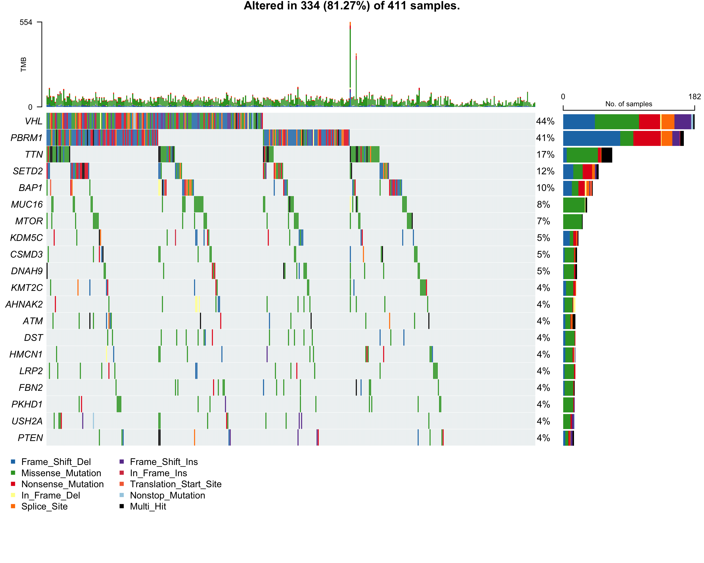
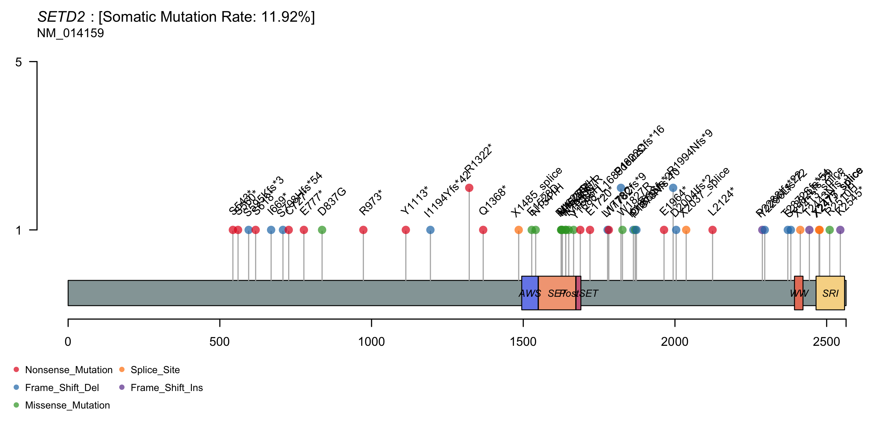
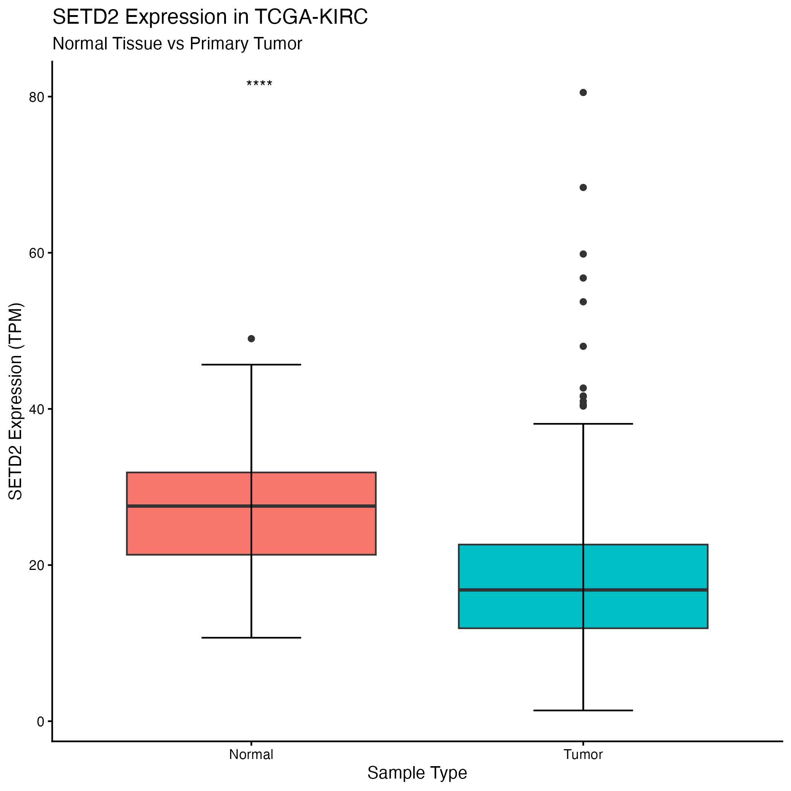
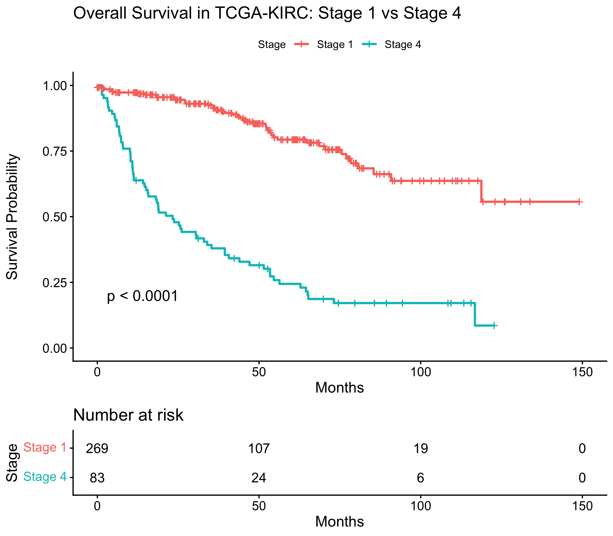

# Cancer Genomics Analysis with R

## Overview

This repository documents my learning and exploration of cancer genomics using R during and after the Rosetta Institute Cancer Bioinformatics workshop.

Through the workshop, I learned how R and Bioconductor can be used to work with real cancer genomics data, including mutation, gene expression, and clinical data.

I used the techniques I learned to explore cancer datasets and investigate genes related to cancer, including SETD2, TP53, and KRT19. I also used a Pokémon dataset as a practice dataset while learning how to create graphs in R.

For my main applied analyses, I focused on kidney renal clear cell carcinoma (KIRC) and the gene SETD2.

This repository contains the R code I used while learning, the analyses I organized using those skills, and the graphs produced from those analyses.

## Key Analyses

| Analysis | Question | Method |
|---|---|---|
| KIRC Mutation Landscape | Which genes are frequently mutated? | Oncoplot |
| SETD2 Mutation Positions | Where do SETD2 mutations occur? | Lollipop plot |
| SETD2 Expression | Does expression differ between normal and tumor samples? | Box plot |
| Survival Analysis | How does survival differ by clinical stage? | Kaplan-Meier |

## Project at a Glance

| Analysis                     | Biological Question                                            | Method                            | Main Observation                                                                                     |
| ---------------------------- | -------------------------------------------------------------- | --------------------------------- | ---------------------------------------------------------------------------------------------------- |
| **KIRC Mutation Landscape**  | Which genes are frequently mutated in KIRC?                    | `maftools` oncoplot               | VHL and PBRM1 had the highest mutation percentages shown, while SETD2 was mutated in 12% of samples. |
| **SETD2 Mutation Positions** | Where do SETD2 mutations occur within the protein?             | Lollipop plot                     | SETD2 mutations were distributed across the protein rather than concentrated at one clear hotspot.   |
| **SETD2 Expression**         | Does SETD2 expression differ between normal and tumor tissue?  | Box plot + statistical comparison | SETD2 expression was generally lower in tumor samples than in normal samples.                        |
| **KIRC Survival**            | How does survival differ between Stage 1 and Stage 4 patients? | Kaplan-Meier survival analysis    | Stage 1 patients had a higher survival probability than Stage 4 patients (`p < 0.0001`).             |

## Why I Did This

I am interested in computational biology and bioinformatics.

Before participating in the Rosetta Institute workshop, I had mainly studied biology and programming separately. I wanted to learn how programming could be used to investigate biological questions using real biological data.

The workshop gave me my first opportunity to work with cancer genomics datasets and to use R for biological data analysis.

Through this experience, I became interested in the process of going from:

**biological question → biological data → computational analysis → visualization → interpretation**

## My Learning Process

The repository is divided into two main parts.

### 1. Lessons

The `01_Lessons/` directory contains code from the R and bioinformatics concepts I learned during the workshop.

These files document my progression from basic R programming and data manipulation to cancer genomics, gene expression analysis, and survival analysis.

### 2. Applied Analyses

The `03_Analysis/` directory contains cleaned and reorganized analyses based on techniques I learned during the workshop.

I applied these methods mainly to TCGA-KIRC data, with a focus on SETD2.

The purpose was not to claim that I developed all of these analytical methods myself. Instead, I wanted to understand how the methods worked, apply them to biological data, organize the analyses more clearly, and interpret what the resulting graphs showed.

## What I Learned

During this project, I gained experience with:

* R programming
* RStudio
* data frames and data manipulation
* dplyr
* tidyverse
* ggplot2
* Bioconductor
* TCGAbiolinks
* maftools
* TCGA cancer genomics data
* somatic mutation analysis
* mutation visualization
* oncoplots
* lollipop plots
* gene expression analysis
* box plots
* Kaplan-Meier survival analysis
* cBioPortal
* NCI genomic data

More importantly, I learned that bioinformatics is not simply about writing code.

The biological question, dataset, analysis method, visualization, and interpretation all affect what conclusions can be drawn.

## Background: SETD2 and KIRC

The main gene I worked with during the workshop was **SETD2**.

**Ensembl Gene ID: ENSG00000181555**

SETD2 produces a histone methyltransferase that is involved in adding three methyl groups to lysine 36 of histone H3, producing a modification called H3K36me3.

This modification is involved in several important cellular processes, including gene regulation, DNA repair, and maintenance of genome stability. Because of these functions, loss or disruption of normal SETD2 activity has been studied in relation to several types of cancer.

Because SETD2 was the gene assigned to me, I researched its biological functions using scientific papers, including papers found through PubMed. Some of the scientific terminology was unfamiliar to me, so I also used AI as a study aid to help me understand some scientific jargon while referring back to the original papers.

For my analyses, I focused mainly on **kidney renal clear cell carcinoma (KIRC)**.

KIRC is the most common type of kidney cancer in adults. Previous research has found that SETD2 is one of several genes that can be mutated in KIRC, together with genes such as VHL, PBRM1, and BAP1.

This led me to ask:

**What can cancer genomic data tell us about SETD2 mutations and expression in KIRC?**

I explored this question by looking at:

* the overall mutation landscape of KIRC
* the locations of mutations in SETD2
* SETD2 expression in normal and tumor tissue
* survival differences between Stage 1 and Stage 4 KIRC patients

## Analysis 1 — KIRC Mutation Landscape

### Question

**What are the most frequently mutated genes in TCGA-KIRC?**

I used `maftools` to visualize somatic mutation patterns across KIRC samples.



### My Interpretation

VHL (44%) and PBRM1 (41%) had the highest mutation percentages in the oncoplot, while SETD2 was mutated in 12% of the samples.

SETD2 was therefore one of the more commonly mutated genes shown, although it was less frequent than VHL and PBRM1. Other frequently mutated genes included TTN and BAP1.

I also noticed that different patients had different combinations and types of mutations. This means that there was not one single mutation pattern shared by every KIRC sample.

This graph helped me understand that even within the same type of cancer, the genetic changes can be different between patients.

Code: `03_Analysis/01_kirc_mutation_landscape.R`

## Analysis 2 — SETD2 Mutation Positions

### Question

**Where do mutations in SETD2 occur within the protein?**

I used a lollipop plot to visualize the locations and types of SETD2 mutations.



### My Interpretation

The SETD2 mutations were spread across different positions of the protein rather than being concentrated at one clear hotspot.

Not many patients appeared to have mutations at exactly the same position. I also noticed mutations around important regions of the protein, including around the SET domain.

This was interesting because the SET domain is important for SETD2's methyltransferase function.

However, the graph alone cannot prove how each individual mutation changes the function of SETD2. I learned that knowing **where** a mutation occurs can give additional information beyond simply knowing whether a gene is mutated.

Code: `03_Analysis/02_setd2_mutation_positions.R`

## Analysis 3 — SETD2 Expression in Normal and Tumor Samples

### Question

**Does SETD2 expression differ between normal and tumor samples in TCGA-KIRC?**

I compared SETD2 expression between normal tissue and primary tumor samples.



### My Interpretation

SETD2 expression was generally lower in the tumor samples than in the normal samples because the median expression level was lower in the tumor group.

I also noticed that the tumor samples had a wider spread and some more extreme values.

The statistical comparison indicated that there was a significant difference between the two groups.

At first, I thought that lower SETD2 expression might directly mean that SETD2 had been deleted in the tumor cells. However, I learned that this graph alone cannot tell us **why** the expression level is lower.

Other biological mechanisms could also affect gene expression, so additional analyses would be needed before explaining the cause of this difference.

Code: `03_Analysis/03_setd2_expression_normal_vs_tumor.R`

## Analysis 4 — Survival Analysis

### Question

**How does overall survival differ between Stage 1 and Stage 4 patients in TCGA-KIRC?**

I used Kaplan-Meier survival analysis to compare patients in the two clinical-stage groups.



### My Interpretation

The Kaplan-Meier curve showed that Stage 1 patients had a higher survival probability than Stage 4 patients.

The difference between the two groups became clearer as time passed. The p-value was less than 0.0001, suggesting that the difference between the two survival curves was statistically significant.

This analysis helped me understand how clinical information can be combined with computational analysis to investigate patient outcomes.

However, this analysis compares **clinical stage**, not SETD2 mutation or expression. Therefore, it does not show that SETD2 itself caused the difference in survival.

Code: `03_Analysis/04_kirc_stage_survival.R`

## What I Learned From the Analyses

The four analyses helped me understand that different kinds of biological data require different analytical approaches.

For example:

* mutation data can be represented using oncoplots
* mutation positions can be visualized using lollipop plots
* gene expression can be compared using box plots
* clinical outcomes can be investigated using Kaplan-Meier survival analysis

One important thing I learned from this project is that **making a graph is not the same as proving a biological explanation**.

At first, I sometimes tried to explain a pattern immediately. For example, when I saw lower SETD2 expression in tumor samples, I thought that this must mean that SETD2 had been deleted.

Through these analyses, I learned that I need to separate **what I can actually observe in the data** from **what I think might explain the observation**.

I also learned that different types of data show different parts of the same biological problem.

Mutation data, gene expression data, and clinical survival data can all be useful, but they answer different questions and have to be interpreted differently.

Producing a graph is therefore only one step in bioinformatics.

A more important question is:

**What does the graph actually tell us about the biological question?**

## Limitations

These analyses were conducted mainly as a learning and exploration project rather than as a clinical or definitive biological study.

There are several limitations.

### Association does not mean causation

An observed association in a dataset does not necessarily demonstrate a causal biological relationship.

For example, lower SETD2 expression in tumor samples does not by itself prove that reduced SETD2 expression caused the cancer.

### Clinical Factors

Survival can be affected by many different factors.

Comparing patients based only on clinical stage does not include every other factor that may influence patient survival.

### Gene Expression

Differences in gene expression can be caused by many biological and technical factors.

The box plot shows that SETD2 expression differs between the groups, but it does not identify the mechanism responsible for that difference.

### Statistical Analysis

Some of these analyses are exploratory.

Additional statistical testing, biological interpretation, and validation would be necessary before drawing stronger conclusions.

Understanding these limitations was an important part of learning how to interpret biological data responsibly.

## My Contribution

The Rosetta Institute workshop provided the instructional foundation and workflows used in this project.

My work in developing this repository included:

* learning and applying R and bioinformatics workflows introduced during the workshop
* organizing the workshop learning materials into the `01_Lessons/` directory
* reorganizing and cleaning the analysis scripts
* applying the methods mainly to TCGA-KIRC data with a focus on SETD2
* generating and organizing the final visualizations
* comparing mutation, expression, and clinical data
* interpreting the results shown in the figures
* documenting the analyses, limitations, and future questions in this README

The `01_Lessons/` directory documents my learning process, while the `03_Analysis/` directory contains the cleaned analyses using those methods.

The interpretations of the graphs in this README are based on my own observations and on work I had previously written about SETD2 and KIRC.

I also used AI as a learning and debugging aid. It helped me organize the repository, improve some of the English, identify and correct coding problems, and understand unfamiliar scientific terminology. I reviewed the suggestions, checked the analysis outputs myself, and referred back to the original data and scientific sources.

## Connection to Computational Biology

This project strengthened my interest in computational biology and bioinformatics.

Before the workshop, I had mainly experienced biology and programming as separate subjects. Through this project, I started to understand how programming can be used as a tool for asking biological questions.

I became interested in how biological information can be transformed into computational data and how different analytical methods can reveal different patterns in the same dataset.

It also made me think more about the relationship between experimental biology and computational analysis.

In particular, I became interested in how experimental variation and noise can affect biological data and how computational methods can distinguish biological signals from noise.

This connects to my broader interest in **environmental DNA (eDNA)** and computational methods for detecting organisms from DNA sequence data.

## Future Work

One question I would like to investigate next is whether **SETD2 mutation status or SETD2 expression level is associated with patient survival**, rather than only comparing patients by clinical stage.

I would also like to compare SETD2 across different cancer types to see whether similar mutation and expression patterns appear elsewhere.

As I continue learning, I would like to develop stronger statistical skills and learn how multiple types of genomic information—such as mutation, gene expression, and clinical data—can be analyzed together.

In the future, I would also like to apply what I learned about biological data, variation, and computational analysis to my interest in environmental DNA.

In particular, I am interested in how computational methods can distinguish real biological signals from experimental or sequencing noise.

## Repository Structure

```text
Analyzing-Cancer-Data-through-Graph/
│
├── README.md
│
├── 01_Lessons/
│
├── 02_Figures/
│   ├── 01_kirc_oncoplot.png
│   ├── 02_setd2_lollipop.png
│   ├── 03_setd2_expression_normal_vs_tumor.png
│   └── 04_kirc_stage1_vs_stage4_survival.png
│
├── 03_Analysis/
│   ├── 01_kirc_mutation_landscape.R
│   ├── 02_setd2_mutation_positions.R
│   ├── 03_setd2_expression_normal_vs_tumor.R
│   └── 04_kirc_stage_survival.R
│
└── 04_Data/
    └── README.md
```

## Data Sources

This project uses cancer genomics and clinical data associated with **The Cancer Genome Atlas (TCGA)**.

The analyses include mutation, gene expression, and clinical data related to TCGA-KIRC.

Some datasets were provided or prepared as part of the Rosetta Institute workshop, while other information was accessed through cancer genomics resources introduced during the workshop.

The large data files used locally for the analyses are not included in this public repository. The `04_Data/README.md` file documents the expected data files and their sources.

## References

Chen, L., Zou, Y., Dong, Y., Hong, T., Xu, Q., & Zhang, J. (2025). *Emerging role of SETD2 in the development and function of immune cells*. Genes & Diseases.

Jena, R. S., & Mishra, A. (2026). *Multi-omics insights into tumor grade progression in clear cell renal cell carcinoma: from molecular mechanisms to precision therapeutics*. Frontiers in Cell and Developmental Biology, 14, 1815377.

Jixiang, B., Xin, C., Xiaoxuan, P., Mingli, S., Jieru, H., & Shuhui, W. (2026). *Emerging roles for the epigenetic modifiers PBRM1, SETD2 and BAP1 in clear cell renal cell carcinoma pathogenesis and prognosis beyond VHL*. Discover Oncology, 17(1), 528.

Additional cancer genomic and clinical data were obtained through resources associated with TCGA and the NCI Genomic Data Commons.
